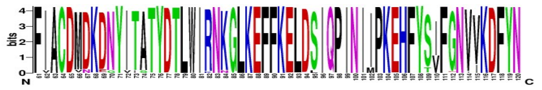
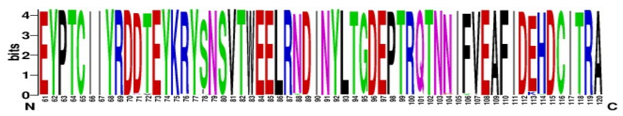
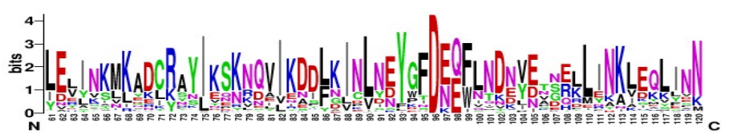
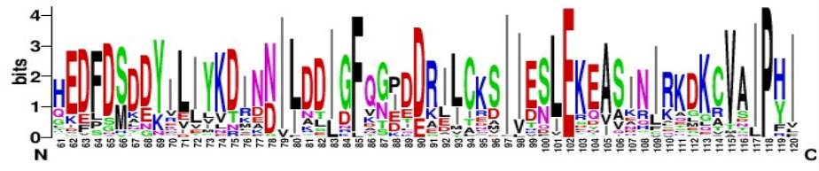

# 2. Information content
<ol type="a" start="4">
  <li>Since 2014, many genomes of crAss-like phages have been sequenced and become available. Look at the following snippet of a multiple DNA sequence alignment of six crAssphage genes encoding homologs of protein 66. Which position(s) is/are most conserved?</li>
</ol>

```fasta
TTATCATGGCAAATCTTT
TTGTCATGGCAGATCTTC
TTATCGTGGCAGATCTTT
ACCAGGTGA------TTC
ATCAGGTGA------TTC
ACCAGATGA------TTT
```

<ol type="a" start="5">
  <li>Assume that the previous alignment starts with the first position of a codon. Give a biological explanation for some positions being more conserved than others.</li>
  <li>Below you can see a different sequence alignment snippet. What is the consensus sequence of this alignment? Take as consensus sequence one that can represent simultaneously all of the sequences in the alignment. What is the <strong>reverse</strong> complement of the consensus sequence? Hint: find the single-letter code for DNA sequences online.</li>
</ol>

```fasta
CTAATTATT
CTGATTGTT
CTAATTATA
ATCAATTTA
ATAGACTTG
ATAGATTTG
```

<ol type="a" start="7">
  <li>Look at the <a href="https://en.wikipedia.org/wiki/Sequence_logo">sequence logos</a> of (regions of) four different crAssphage proteins below. Each of these sequence logos was based on an alignment of proteins from >200 different crAssphages. What differences do you see? Are all proteins similarly conserved? Provide a biological explanation why different proteins could be conserved to different degrees.</li>
</ol>


*Sequence logo of residues 61-120 of an amino acid sequence alignment of >200 homologs of **KP06_gp27** from different crAss-like viruses.*

---


*Sequence logo of residues 61-120 of an amino acid sequence alignment of >200 homologs of **KP06_gp38** from different crAss-like viruses.*

---


*Sequence logo of residues 61-120 of an amino acid sequence alignment of >200 homologs of **KP06_gp51** from different crAss-like viruses.*

---


*Sequence logo of residues 61-120 of an amino acid sequence alignment of >200 homologs of **KP06_gp85** from different crAss-like viruses.*

<ol type="a" start="8">
  <li>How can you recognize from a sequence logo which amino acids are probably the most important for the function of a protein? Give an explanation that considers the evolution of the protein. Which residues are probably important for the function of KP06_gp85? And which residues are probably less important for the function of that protein? How about KP06_gp38?</li>
</ol>

[Go to module 3](03-Inferring_protein_function.md)
