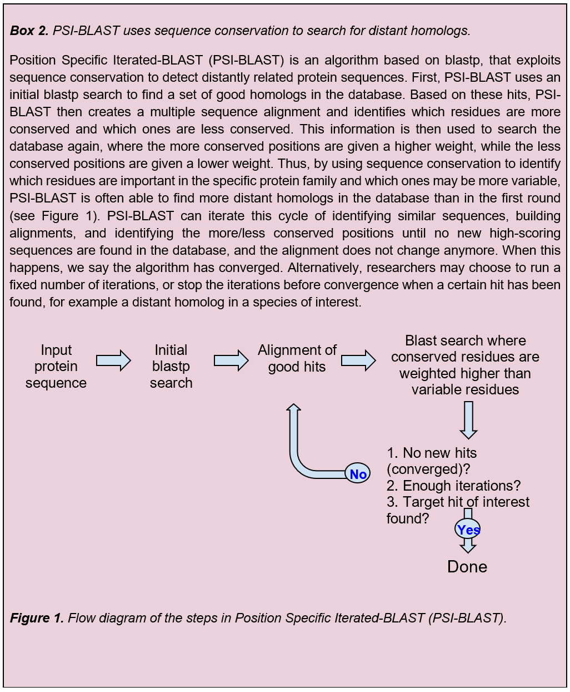

# 4. Gene prediction
<ol type="a" start="13">
    <li>
        Download the NC_067194 genome in FASTA format. Now use <a href="https://genemark.bme.gatech.edu/genemarks.cgi">GeneMarkS</a> to predict the number of protein-coding genes in this genome. Select “Phage” as sequence type, and “GFF” as output format. The prediction should take only a couple of seconds. How many genes does GeneMarkS predict? How does this compare with the number of genes in the NCBI genome? Why do you think these numbers may differ?
    </li>
    <li>OPTIONAL: Now let's visualize the differences using the genome browser <a href="https://sanger-pathogens.github.io/Artemis/Artemis/">Artemis</a>. Download the UNIX or MacOS version, and uncompress following the website’s instructions. Then, open Artemis. Download the NC_067194 genome in Genbank format, and open it using Artemis. It will display an overview of the CDS features in the crAssphage genome. Move around and explore the genome in all its length. Try zooming in and out for better views, and click on the genes to see the associated features. Now, read the GeneMarkS gene predictions as an additional entry using “Read An Entry…”. You can switch between predictions (NCBI vs GeneMarkS) by clicking on these entries below the main menu. Find CDSs predicted by one genome version but not the other, and discuss how to evaluate which prediction is correct.</li>
</ol>

Today, you have learned about sequence conservation. You have learned to interpret sequence logos and identify conserved (regions in) genes or proteins. You have seen that some proteins of the crAssphage are more conserved than others, and that within a protein, some amino acids are more conserved than others. Finally, you have seen how PSI-BLAST, which makes use of sequence conservation, can be used to perform sensitive sequence similarity searches and find distantly related proteins.

    

